# Frictionless Incline
## Example 1-1
**Problem:** A block of mass *m* = 8.7 *kg* is pulled up a frictionless $\theta$ = 23° incline by a force *F* = 45 *N*.
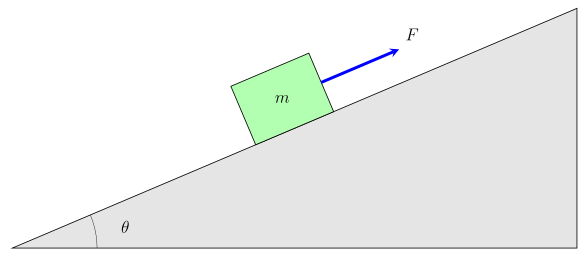
**a)** Draw a free body diagram
**b)** Find the acceleration of the block if the incline is frictionless
**c)** Find the normal force

---
## Example 1-2
**Problem:** A block of mass *m* = 120 *kg* is sliding down a frictionless decline of $\theta$ = 45°.
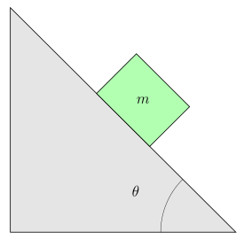
**a)** Draw a free body diagram
**b)** Find the acceleration of the block
**c)** Find the normal force

---
## Example 1-3
**Problem:** A block of mass *m* = 45 *kg* is on a frictionless slope of $\theta$ = 35° with a force of *F* = 200 *N* pushing the block up the slope. 
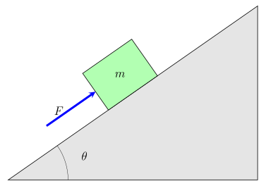
**a)** Draw a free body diagram
**b)** Find the acceleration of the block
**c)** Find the normal force
**d)** What change could we make to the example for the box to sit motionless on the slope? Show that change.

---
## Example 1-4
**Problem:** A block with a mass of *m* = 20 *kg* is on a frictionless decline of $\theta$ = 66° with a downward force of *F* = 100 *N* pulling the block down.
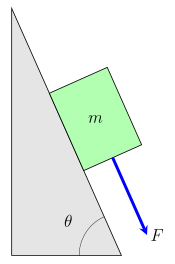
**a)** Draw a free body diagram
**b)** Find the acceleration of the block
**c)** Find the normal force

---
## Example 1-5
**Problem:** A block of mass *m* = 15 *kg* is on a frictionless slope of $\theta$ = 30°. A horizontal force *F* = 120 *N* pushes the block up the slope.
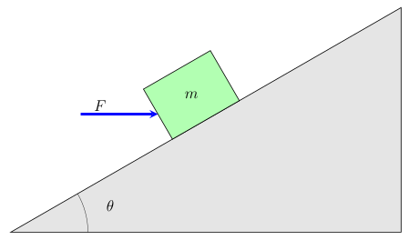
**a)** Draw a free body diagram
**b)** Find the acceleration of the block
**c)** Find the normal force

---
## Example 1-6
**Problem:** A block of mass *m* = 12 *kg* is released from rest on a frictionless decline and slides down with an acceleration of *a* = 4.2 m/s². The angle of the decline is unknown.
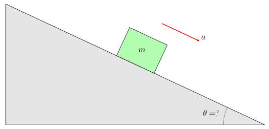
**a)** Draw a free body diagram
**b)** Find the angle $\theta$ of the decline
**c)** Find the normal force
**d)** If the block were swapped for a 30 *kg* block, would the acceleration change? Would the normal force?

---
# Moving on Surface with Friction
## Example 2-1
**Problem:** A $1.00 \times 10^{3}$ N box is being pulled across level ground at a constant speed by a force $\vec{F}$ of $3.00 \times 10^{2}$ N at an angle of 20.0$^{\circ}$ above the horizontal plane.
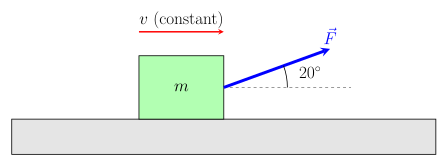
**a)** Draw a free body diagram
**b)** Find the frictional force between the box and the ground
**c)** What is the coefficient of kinetic friction between the box and the ground?

---
## Example 2-2
**Problem:** A 200 kg box is pushed across a level floor at a constant acceleration of 0.2 m/s$^2$ by a force of 500 N at an angle of 20$^{\circ}$ below the horizontal plane.
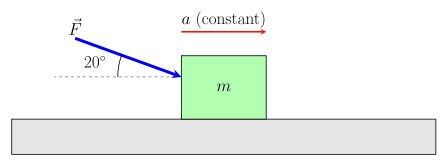
**a)** Draw a free body diagram for the box
**b)** Find the frictional force between the box and the floor
**c)** What is the coefficient of kinetic friction between the box and the floor?

---

## Example 2-3
**Problem:** A 30 kg box is placed on an incline of 37$^{\circ}$ with a horizontal force of 30 N. The box is sliding down the slope at a constant speed.
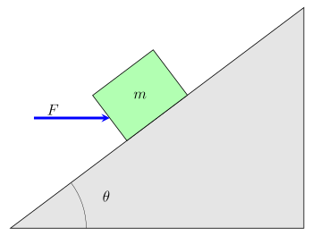
**a)** Draw a free body diagram
**b)** Find the frictional force between the box and the incline
**c)** What is the coefficient of kinetic friction between the box and the incline?
**d)** The coefficient of static friction between the box and the incline is $\mu_s$ = 0.70. Once the box is brought to a stop, what is the smallest horizontal force needed to keep it from sliding back down the slope?

---
## Example 2-4
**Problem:** A 40 kg box is placed on an incline of 30$^{\circ}$ with a force of 300 N applied 20$^{\circ}$ above the horizontal plane. The box is accelerating up the slope at 0.32 m/s$^2$.
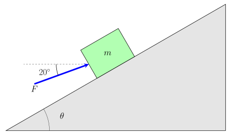
**a)** Draw a free body diagram
**b)** Find the frictional force between the box and the incline
**c)** What is the coefficient of kinetic friction between the box and the incline?

---
## Example 2-5
**Problem:** A 12 kg box slides down an incline of 28$^{\circ}$ with no applied force. The box is accelerating down the slope at 2.1 m/s$^2$.
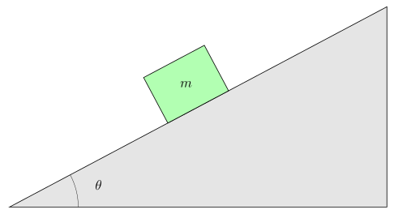
**a)** Draw a free body diagram
**b)** Find the frictional force between the box and the incline
**c)** Find the normal force
**d)** What is the coefficient of kinetic friction between the box and the incline?
**e)** At what angle would the box slide down at a constant speed?

---
## Example 2-6
**Problem:** A 30 kg crate sits at rest on a level floor. The coefficient of static friction is $\mu_s$ = 0.50 and the coefficient of kinetic friction is $\mu_k$ = 0.35. A rope pulls on the crate at 25$^{\circ}$ above the horizontal.
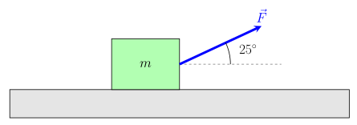
**a)** Draw a free body diagram
**b)** If the rope pulls with *F* = 120 N, does the crate move? What is the frictional force?
**c)** What is the smallest force *F* that will start the crate moving?
**d)** Once the crate starts moving, the rope keeps pulling with that same force. What is the crate's acceleration?

---
# Constant Speed Rotations
## Example 3-1
**Problem:** An object of mass m = 30 $kg$ sits on a platform that moves in a circular motion. The object moves in a vertical circle of radius 10 $m$ at a constant speed of 4 $m/s$.
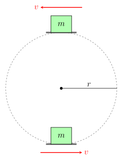
**a)** Determine the force exerted by the platform on the object at the bottom of the ride, start with a free body diagram.
**b)** Find the force exerted by the platform on the object at the top of the ride, start with a free body diagram.

---
## Example 3-2
**Problem:** An object of mass m = 1.2 $kg$ is attached to a rope that moves in a circular motion. The object moves in a vertical circle of radius 0.5 $m$. 
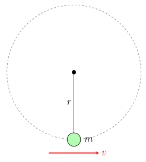
**a)** Determine the speed of the object when the object is at its lowest point and the tension on the rope is $23.7 \text{ N}$.

---
## Example 3-3
**Problem:** The object from Example 3-1 (mass *m* = 30 kg) rides on a platform moving in a vertical circle of radius 10 m. How fast would the platform have to go for the object to feel **weightless** at the top of the ride?
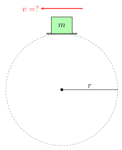
**a)** What does "weightless" mean for the force from the platform? Draw a free body diagram at the top.
**b)** Find the speed that makes the object feel weightless at the top.
**c)** Would a heavier object need a different speed? What happens if the ride goes faster than this?

---
## Example 3-4
**Problem:** The object from Example 3-2 (mass *m* = 1.2 kg) swings on a rope in a vertical circle of radius 0.5 m. At the top of the circle it is moving at 3.0 m/s.
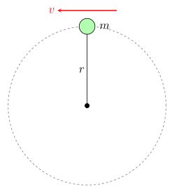
**a)** Draw a free body diagram at the top of the circle.
**b)** Find the tension in the rope at the top.
**c)** What is the slowest the object can move at the top without the rope going slack?

---
## Example 3-5
**Problem:** The same 1.2 kg object swings on a rope in a vertical circle of radius 0.5 m, but the rope breaks if the tension goes over 50 N.

**a)** Where in the circle is the tension the biggest? Why?
**b)** Draw a free body diagram at that point.
**c)** What is the fastest the object can go there without breaking the rope?

---
# Work and the Work–Energy Theorem
## Example 4-1
**Problem:** An object of mass 3000 $kg$ starts at rest and is lifted up by a platform that exerts an upward force of 40 $kN$ on the object. This force is applied over 3 $m$. 
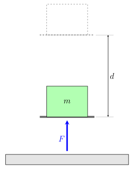
**a)** Find the net work done on the object
**b)** Find the upward speed of the object after the 3 $m$.

---
## Example 4-2
**Problem:** Three ropes drag a 15 $kg$ box from rest a distance of 7 $m$ across the floor to the right. All three ropes pull parallel to the floor. One rope pulls with 250 $N$ at 18$^{\circ}$ to one side of the forward direction, the second pulls with 1000 $N$ at 45$^{\circ}$ to the other side of the forward direction, and the third pulls straight backward with 450 $N$.
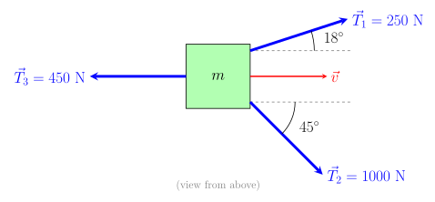
**a)** How much work is done by each of the three forces?
**b)** What is the net work done on the box?
**c)** After 7 m, what is the kinetic energy of the box?

---
## Example 4-3
**Problem:** A 20 $kg$ box starts at rest at the bottom of a 30$^{\circ}$ slope. A 200 $N$ force pushes it 5 $m$ up the slope, parallel to the slope's surface. The coefficient of kinetic friction between the box and the slope is 0.2.
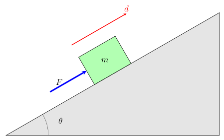
**a)** Find the work done on the box by each force: the push, gravity, friction, and the normal force.
**b)** What is the net work done on the box?
**c)** How fast is the box moving after 5 $m$?

---
## Example 4-4
**Problem:** The 3000 $kg$ object from Example 4-1 starts at rest and is lifted 3 $m$ by a platform. How strong would the platform's upward force need to be for the object to be moving upward at 6 $m/s$ after the 3 $m$?
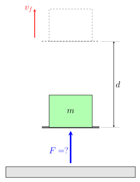
**a)** How much net work is needed?
**b)** How much work does gravity do?
**c)** How much work must the platform do, and how big is its force?

---
## Example 4-5
**Problem:** A 20 $kg$ box is dragged 5 $m$ across the floor from rest by two ropes. The first rope pulls with 150 $N$ at 30$^{\circ}$ above the horizontal, and the second rope pulls straight forward with 80 $N$. The coefficient of kinetic friction between the box and the floor is 0.3.
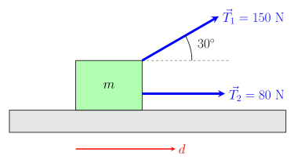
**a)** Find the normal force and the friction force on the box.
**b)** Find the work done by each force: both ropes, friction, gravity, and the normal force.
**c)** What is the net work, and how fast is the box moving after 5 $m$?

---
## Example 4-6
**Problem:** A 40 $kg$ box is pulled 6 $m$ across the floor from rest by two ropes that both pull parallel to the floor. One rope pulls with 200 $N$ at 15$^{\circ}$ to one side of the forward direction, and the other pulls with 150 $N$ at 40$^{\circ}$ to the other side. Friction acts on the box, and after the 6 $m$ the box is moving at 6 $m/s$.
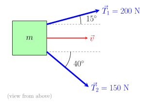
**a)** How much work is done by each rope?
**b)** What is the box's final kinetic energy, and what is the net work done on it?
**c)** How much work does friction do? Find the friction force and the coefficient of kinetic friction.

---
# Energy Conservation with Springs, Hills and Friction
## Example 5-1
**Problem:** An object of mass 80 kg is at the top of a frictionless slide of height 20 $m$. It is sitting against a spring that is compressed by 1 m and has a spring constant of *k* = 50,000 N/m.
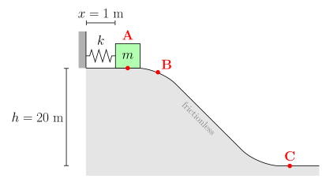
**a)** What is the elastic potential energy stored in the compressed spring?
**b)** What is the object's speed just after it leaves the spring?
**c)** What is the object's speed at ground level?

---
## Example 5-2
**Problem:** A block with a mass of 5 $kg$ is pushed with a velocity of 10 $m/s$ along a frictionless track from one level to a higher level after passing through an intermediate valley. Once the block reaches the higher level it levels off into a frictional horizontal plane. The higher plane is 1.1 $m$ higher than the initial plane. The frictional force of the plane is 11.8 $N$.
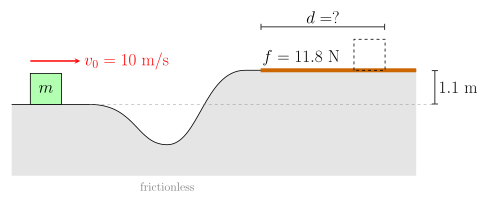
**a)** What is the initial kinetic energy of the block?
**b)** How far does the block slide along the frictional plane before it stops?

---
## Example 5-3
**Problem:** A block with a mass of 10 kg is pushed from a frictionless horizontal plane with a speed of 45 $m/s$. The plane is a series of hills and valleys that dip down to the initial elevation.
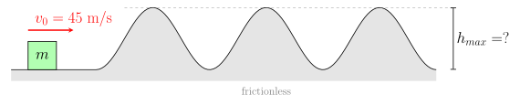
**a)** What is the maximum height the hills can have for the block to keep sliding over them forever?

---
## Example 5-4
**Problem:** An object of mass 30 kg sits at the top of a frictionless slope that is 20 m high. The object is pushed up against a spring that is compressed 1.2 m and has a k value of 50,000 N/m. At the end of the slope there is a 20 m track of a frictional horizontal surface with a coefficient of friction of 0.32. After the frictional surface there is an infinite frictionless incline.
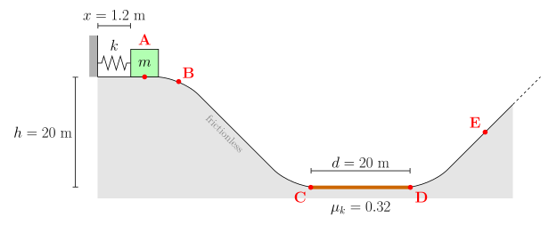
**a)** What are the kinetic and potential energy of the object before the spring releases its energy?
**b)** After the spring has released its energy, but before the object goes down the slope, what are its kinetic energy, potential energy and velocity?
**c)** At point C, just before the rough track, what are the object's kinetic energy, potential energy and velocity?
**d)** At point D, the end of the rough track, what are the object's kinetic energy, potential energy and velocity?
**e)** How high up the incline does the object get before it stops?

---
## Example 5-5
**Problem:** A block with a mass of 10 kg is pushed along a horizontal plane with a speed of 40 $m/s$. The plane is a series of frictionless hills that go up 45 $m$ and valleys that dip down to the initial elevation. Before the first hill, and in each valley, there is a 5 m frictional horizontal plane with a coefficient of friction of 0.65.
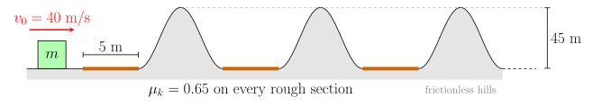
**a)** How many hills can the block get over before it can't make it over the next one?

---
# Momentum and Collisions
## Example 6-1
**Problem:** A 1200 $kg$ car traveling east at 15 $m/s$ collides at an intersection with a 1500 $kg$ truck traveling north at 10 $m/s$. The two vehicles lock together and slide off as one.
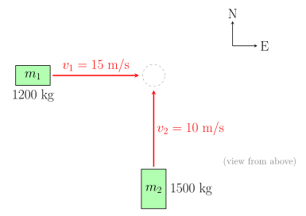
**a)** Explain why this is a perfectly inelastic collision.
**b)** Find the velocity (magnitude and direction) of the wreck right after the collision.
**c)** How much kinetic energy is lost in the collision?

---
## Example 6-2
**Problem:** An 80 $kg$ hockey player skating east at 6 $m/s$ collides head-on with a 100 $kg$ player skating west at 4 $m/s$. The two players grab onto each other and move together after the collision.
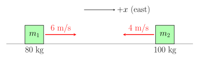
**a)** Find the velocity (magnitude and direction) of the two players right after the collision.
**b)** How fast would the 100 $kg$ player need to be skating west for the two players to stop completely after the collision?

---
## Example 6-3
**Problem:** A 70 $kg$ running back running east is tackled by a 90 $kg$ linebacker running north. Right after the tackle, the two players move together at 4 $m/s$ at 30$^{\circ}$ north of east.
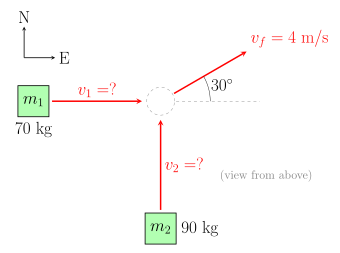
**a)** Find the speed of each player just before the tackle.

---
## Example 6-4
**Problem:** Two pucks slide on frictionless ice. A 2 $kg$ puck slides east at 3 $m/s$. A 3 $kg$ puck slides at 2 $m/s$ in a direction 60$^{\circ}$ north of west. The pucks collide and stick together.
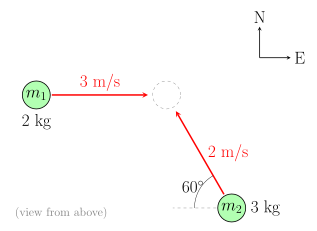
**a)** Find the $x$ (east) and $y$ (north) components of each puck's momentum before the collision.
**b)** Find the velocity (magnitude and direction) of the pucks after the collision.
