# Frictionless Incline
## Example 1-1
**Problem:** A block of mass *m* = 8.7 *kg* is pulled up a frictionless $\theta$ = 23° incline by a force *F* = 45 *N*.

$$
\begin{gathered}
\textbf{Formulas:} \\
\sum \vec{F}= m \vec{a} \\
\end{gathered}
$$
**a)** Draw a free body diagram

Three forces act on the block: gravity (*mg*) straight down, the normal force (*n*) perpendicular to the incline, and the pull *F* along the incline. The first diagram uses regular *x*/*y* axes, so *F* and *n* both have to be split into parts. The second tilts the axes to match the incline, so only *mg* needs splitting, which is usually the easier choice.
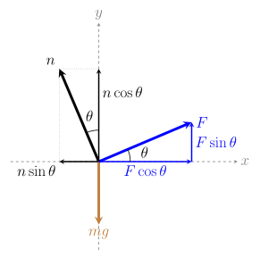
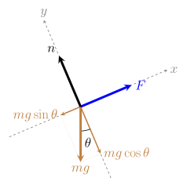
**b)** Find the acceleration of the block if the incline is frictionless

Take +*x* up the slope. *F* pulls up the slope and the $mg\sin\theta$ part of gravity pulls down it. Whatever is left over accelerates the block:
$$
\begin{gather*}
\sum F_{x} = ma_{x} \\ \\
\begin{aligned}
F - mg\sin \theta &= ma \\
ma &= F - mg\sin \theta \\
a &= \frac{F - mg \sin \theta}{m} \\
a &= \frac{45 - (8.7)(9.8) \sin 23^{\circ}}{8.7} \\
a &= \boxed{1.34325 \text{ m/s}^2}
\end{aligned}
\end{gather*}
$$
**c)** Find the normal force

The block doesn't sink into or lift off the incline, so the forces perpendicular to it balance. The normal force pushes back against the $mg\cos\theta$ part of gravity:
$$
\begin{gathered}
\sum F_{y}=0 \\ \\
\begin{aligned}
n - mg\cos \theta &= 0 \\
n &= mg \cos \theta \\
n &= (8.7)(9.8)\cos{23}^{\circ} \\
n &= \boxed{78.48224 \text{ N}}
\end{aligned}
\end{gathered}
$$
---
## Example 1-2
**Problem:** A block of mass *m* = 120 *kg* is sliding down a frictionless decline of $\theta$ = 45°.

$$
\begin{gathered}
\textbf{Formulas:} \\
\sum \vec{F}= m \vec{a} \\
\end{gathered}
$$
**a)** Draw a free body diagram

With no push and no friction, only gravity and the normal force act. Take +*x* down the slope, the way the block slides. Gravity splits into $mg\sin\theta$ along the slope and $mg\cos\theta$ into it.
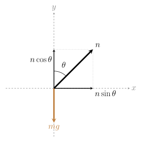
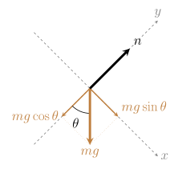
**b)** Find the acceleration of the block

The only force along the slope is $mg\sin\theta$, so it alone causes the acceleration. Notice the mass cancels:
$$
\begin{gather*}
\sum F_{x} = ma_{x} \\ \\
\begin{aligned}
mg\sin \theta &= ma \\
a &= g\sin \theta \\
a &= (9.8) \sin 45^{\circ} \\
a &= \boxed{6.92965 \text{ m/s}^2}
\end{aligned}
\end{gather*}
$$
**c)** Find the normal force

The block doesn't sink into or lift off the slope, so *n* balances $mg\cos\theta$:
$$
\begin{gathered}
\sum F_{y}=0 \\ \\
\begin{aligned}
n - mg\cos \theta &= 0 \\
n &= mg \cos \theta \\
n &= (120)(9.8)\cos{45}^{\circ} \\
n &= \boxed{831.55757 \text{ N}}
\end{aligned}
\end{gathered}
$$
---
## Example 1-3
**Problem:** A block of mass *m* = 45 *kg* is on a frictionless slope of $\theta$ = 35° with a force of *F* = 200 *N* pushing the block up the slope. 

$$
\begin{gathered}
\textbf{Formulas:} \\
\sum \vec{F}= m \vec{a} \\
\end{gathered}
$$
**a)** Draw a free body diagram

Same setup as Example 1-1, with *F* pushing up the slope. The question is whether *F* is big enough to beat gravity's pull down the slope.
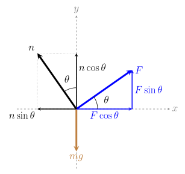
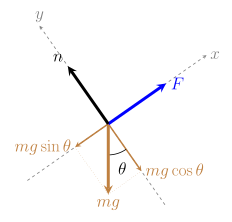
**b)** Find the acceleration of the block

Take +*x* up the slope. *F* pushes up and $mg\sin\theta$ pulls down:
$$
\begin{gather*}
\sum F_{x} = ma_{x} \\ \\
\begin{aligned}
F - mg\sin \theta &= ma \\
a &= \frac{F - mg \sin \theta}{m} \\
a &= \frac{200 - (45)(9.8) \sin 35^{\circ}}{45} \\
a &= \frac{200 - 252.94721}{45} \\
a &= \boxed{-1.17660 \text{ m/s}^2}
\end{aligned}
\end{gather*}
$$
The negative sign means the block accelerates **down** the slope, even though *F* pushes it up. The push (200 N) is smaller than the part of gravity pulling down the slope (252.95 N).

**c)** Find the normal force

*F* is parallel to the slope, so it doesn't push into the surface. The normal force only has to balance $mg\cos\theta$:
$$
\begin{gathered}
\sum F_{y}=0 \\ \\
\begin{aligned}
n - mg\cos \theta &= 0 \\
n &= mg \cos \theta \\
n &= (45)(9.8)\cos{35}^{\circ} \\
n &= \boxed{361.24605 \text{ N}}
\end{aligned}
\end{gathered}
$$

**d)** What change could we make to the example for the box to sit motionless on the slope? Show that change.

Motionless means *a* = 0, so the forces along the slope have to balance: $F = mg\sin\theta$. We can get there by changing any one of *F*, $\theta$, or *m*:

- **Increase the Force:**
$$
\begin{gathered}
\sum F_{x}=0 \\ \\
\begin{aligned}
F - mg\sin \theta &= 0 \\
F &= mg \sin \theta \\
F &= (45)(9.8)\sin{35}^{\circ} \\
F &= \boxed{252.94721 \text{ N}}
\end{aligned}
\end{gathered}
$$
- **Decrease the slope:**
$$
\sin \theta = \frac{F}{mg} = \frac{200}{(45)(9.8)} \quad\Rightarrow\quad \theta = \boxed{26.96941^{\circ}}
$$
- **Decrease the mass of the block:**
$$
m = \frac{F}{g \sin \theta} = \frac{200}{(9.8)\sin 35^{\circ}} \quad\Rightarrow\quad m = \boxed{35.58055 \text{ kg}}
$$
---
## Example 1-4
**Problem:** A block with a mass of *m* = 20 *kg* is on a frictionless decline of $\theta$ = 66° with a downward force of *F* = 100 *N* pulling the block down.

$$
\begin{gathered}
\textbf{Formulas:} \\
\sum \vec{F}= m \vec{a} \\
\end{gathered}
$$
**a)** Draw a free body diagram

Now *F* pulls **down** the slope, the same way gravity does. Take +*x* down the slope, so *F* and $mg\sin\theta$ both point along +*x*.
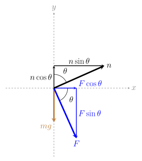
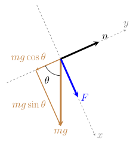
**b)** Find the acceleration of the block

*F* and $mg\sin\theta$ both point down the slope, so they add together. That's why the answer comes out bigger than *g*:
$$
\begin{gather*}
\sum F_{x} = ma_{x} \\ \\
\begin{aligned}
F + mg\sin \theta &= ma \\
a &= \frac{F + mg \sin \theta}{m} \\
a &= \frac{100 + (20)(9.8) \sin 66^{\circ}}{20} \\
a &= \frac{100 + 179.05491}{20} \\
a &= \boxed{13.95275 \text{ m/s}^2}
\end{aligned}
\end{gather*}
$$
**c)** Find the normal force

*F* is parallel to the slope, so the normal force still only balances $mg\cos\theta$:
$$
\begin{gathered}
\sum F_{y}=0 \\ \\
\begin{aligned}
n - mg\cos \theta &= 0 \\
n &= mg \cos \theta \\
n &= (20)(9.8)\cos{66}^{\circ} \\
n &= \boxed{79.72038 \text{ N}}
\end{aligned}
\end{gathered}
$$

---
## Example 1-5
**Problem:** A block of mass *m* = 15 *kg* is on a frictionless slope of $\theta$ = 30°. A horizontal force *F* = 120 *N* pushes the block up the slope.

$$
\begin{gathered}
\textbf{Formulas:} \\
\sum \vec{F}= m \vec{a} \\
\end{gathered}
$$
**a)** Draw a free body diagram

*F* is horizontal, not along the slope, so on the tilted axes it has two parts: $F\cos\theta$ up the slope and $F\sin\theta$ pushing into the slope.
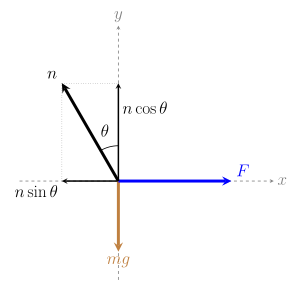
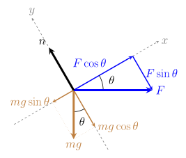
**b)** Find the acceleration of the block

Only the $F\cos\theta$ part of the push acts along the slope, against $mg\sin\theta$:
$$
\begin{gather*}
\sum F_{x} = ma_{x} \\ \\
\begin{aligned}
F\cos \theta - mg\sin \theta &= ma \\
a &= \frac{F\cos \theta - mg \sin \theta}{m} \\
a &= \frac{(120)\cos 30^{\circ} - (15)(9.8) \sin 30^{\circ}}{15} \\
a &= \frac{103.92305 - 73.5}{15} \\
a &= \boxed{2.02820 \text{ m/s}^2}
\end{aligned}
\end{gather*}
$$
**c)** Find the normal force

This time part of the push ($F\sin\theta$) presses the block into the slope, so the normal force has to balance both that and $mg\cos\theta$:
$$
\begin{gathered}
\sum F_{y}=0 \\ \\
\begin{aligned}
n - mg\cos \theta - F\sin \theta &= 0 \\
n &= mg \cos \theta + F\sin \theta \\
n &= (15)(9.8)\cos{30}^{\circ} + (120)\sin{30}^{\circ} \\
n &= 127.30573 + 60 \\
n &= \boxed{187.30573 \text{ N}}
\end{aligned}
\end{gathered}
$$
---
## Example 1-6
**Problem:** A block of mass *m* = 12 *kg* is released from rest on a frictionless decline and slides down with an acceleration of *a* = 4.2 m/s². The angle of the decline is unknown.

$$
\begin{gathered}
\textbf{Formulas:} \\
\sum \vec{F}= m \vec{a} \\
\end{gathered}
$$
**a)** Draw a free body diagram

Only gravity and the normal force act, just like Example 1-2. This time we're given the acceleration and work backwards to find the angle.
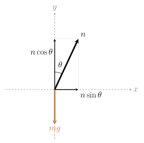
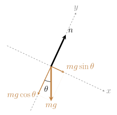
**b)** Find the angle $\theta$ of the decline

Along the slope, $mg\sin\theta = ma$. Solve for $\theta$. The mass cancels, so we don't need *m*:
$$
\begin{gather*}
\sum F_{x} = ma_{x} \\ \\
\begin{aligned}
mg\sin \theta &= ma \\
\sin \theta &= \frac{a}{g} \\
\theta &= \sin^{-1}\left(\frac{a}{g}\right) \\
\theta &= \sin^{-1}\left(\frac{4.2}{9.8}\right) \\
\theta &= \boxed{25.37693^{\circ}}
\end{aligned}
\end{gather*}
$$

**c)** Find the normal force

Now that we know $\theta$, the normal force balances $mg\cos\theta$ as usual:
$$
\begin{gathered}
\sum F_{y}=0 \\ \\
\begin{aligned}
n - mg\cos \theta &= 0 \\
n &= mg \cos \theta \\
n &= (12)(9.8)\cos{25.37693}^{\circ} \\
n &= \boxed{106.25253 \text{ N}}
\end{aligned}
\end{gathered}
$$
**d)** If the block were swapped for a 30 *kg* block, would the acceleration change? Would the normal force?

The acceleration **stays the same**: $a = g\sin\theta$ doesn't depend on mass, so it's still 4.2 m/s².

The normal force **does change**, because it depends on mass:
$$
\begin{aligned}
n &= mg \cos \theta \\
n &= (30)(9.8)\cos{25.37693}^{\circ} \\
n &= \boxed{265.63132 \text{ N}}
\end{aligned}
$$
---
# Moving on Surface with Friction
## Example 2-1
**Problem:** A $1.00 \times 10^{3}$ N box is being pulled across level ground at a constant speed by a force $\vec{F}$ of $3.00 \times 10^{2}$ N at an angle of 20.0$^{\circ}$ above the horizontal plane.

$$
\begin{gathered}
\textbf{Formulas:} \\
\sum \vec{F}= m \vec{a} \\
\mu_{k}=\frac{f_{k}}{n}
\end{gathered}
$$
**a)** Draw a free body diagram

Four forces act on the box: gravity, the normal force, the pull *F* at 20°, and kinetic friction pointing opposite the motion (backwards). *F* splits into a horizontal part $F\cos\theta$ and a vertical part $F\sin\theta$.
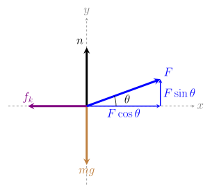
**b)** Find the frictional force between the box and the ground

Constant speed means *a* = 0, so the forces along *x* balance. The forward part of the pull exactly matches friction:
$$
\begin{aligned}
F\cos \theta-f_{k}&=0 \\
F\cos \theta &= f_{k} \\
f_{k} &= F\cos \theta \\
f_{k} &= 300 \cos20^{\circ} \\
f_{k} &= \boxed{281.90779 \text{ N}}
\end{aligned}
$$
**c)** What is the coefficient of kinetic friction between the box and the ground?

$\mu_k = f_k/n$, so first find *n* from the *y* direction:
$$
\begin{aligned}
\sum F_{y}&=0 \\
n+F\sin \theta-mg &= 0 \\
n &= mg - F\sin \theta \\
n &= 1000 - 300 \sin 20^{\circ} \\
n &= 897.39396 \text{ N} \\
\end{aligned}
$$
*F* pulls up on the box, so it lifts some of the weight and the normal force is **less** than *mg*. The problem gives the weight (1000 N), so *mg* is already 1000 N; don't multiply by 9.8 again.
$$
\begin{aligned}
\mu_{k} &=\frac{f_{k}}{n} \\
\mu_{k} &=\frac{281.90779}{897.39396} \\
\mu_{k} &= \boxed{0.31414}
\end{aligned}
$$
---
## Example 2-2
**Problem:** A 200 kg box is pushed across a level floor at a constant acceleration of 0.2 m/s$^2$ by a force of 500 N at an angle of 20$^{\circ}$ below the horizontal plane.

$$
\begin{gathered}
\textbf{Formulas:} \\
\sum \vec{F}= m \vec{a} \\
\mu_{k}=\frac{f_{k}}{n}
\end{gathered}
$$
**a)** Draw a free body diagram for the box

Same forces as Example 2-1, but *F* now points **down** at 20°, so its vertical part $F\sin\theta$ pushes the box into the floor.
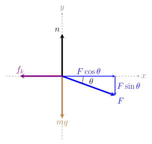
**b)** Find the frictional force between the box and the floor

The box speeds up at 0.2 m/s², so the forces along *x* don't balance. The leftover is *ma*:
$$
\begin{aligned}
\sum F_{x} &= ma \\
F\cos \theta-f_{k} &= ma \\
f_{k}&= F\cos \theta-ma \\
f_{k}&= 500\cos20^{\circ}-(200)(0.2) \\
f_{k} &= \boxed{429.84631 \text{ N}}
\end{aligned}
$$
**c)** What is the coefficient of kinetic friction between the box and the floor?

This time $F\sin\theta$ presses down, so the floor has to push back against both *mg* and $F\sin\theta$. That makes *n* bigger than *mg*:
$$
\begin{aligned}
\sum F_{y}&=0 \\
n-mg-F\sin \theta &= 0 \\
n &= mg+F\sin \theta \\
n &= (200)(9.8) + 500\sin 20^{\circ} \\
n &= 2131.01007 \text{ N}
\end{aligned}
$$
$$
\begin{aligned}
\mu_{k} &= \frac{f_{k}}{n} \\
\mu_{k} &= \frac{429.84631}{2131.01007} \\
\mu_{k} &= \boxed{0.20171} 
\end{aligned}
$$
---
## Example 2-3
**Problem:** A 30 kg box is placed on an incline of 37$^{\circ}$ with a horizontal force of 30 N. The box is sliding down the slope at a constant speed.

$$
\begin{gathered}
\textbf{Formulas:} \\
\sum \vec{F}= m \vec{a} \\
\mu_{k}=\frac{f_{k}}{n}
\end{gathered}
$$
**a)** Draw a free body diagram

The box is sliding **down** the slope, which makes sense: gravity pulls it down the slope with $mg\sin\theta \approx 177$ N, but the push only gives $F\cos\theta \approx 24$ N up the slope. Friction always opposes the motion, so $f_k$ points **up** the slope.
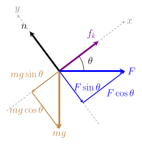
**b)** Find the frictional force between the box and the incline

Constant speed, so the forces along the slope balance. With +*x* up the slope, $F\cos\theta$ and $f_k$ point up and $mg\sin\theta$ points down:
$$
\begin{aligned}
\sum F_{x} &= 0 \\
F\cos \theta + f_{k} - mg\sin \theta &= 0 \\
f_{k} &= mg\sin \theta - F\cos \theta \\
f_{k} &= (30)(9.8)\sin 37^{\circ} - 30\cos 37^{\circ} \\
f_{k} &= 176.93362 - 23.95907 \\
f_{k} &= \boxed{152.97455 \text{ N}}
\end{aligned}
$$
**c)** What is the coefficient of kinetic friction between the box and the incline?

Part of the horizontal push ($F\sin\theta$) presses into the slope, so *n* balances $mg\cos\theta$ plus $F\sin\theta$:
$$
\begin{aligned}
\sum F_{y}&=0 \\
n - mg\cos \theta - F\sin \theta &= 0 \\
n &= mg\cos \theta + F\sin \theta \\
n &= (30)(9.8)\cos 37^{\circ} + 30\sin 37^{\circ} \\
n &= 234.79884 + 18.05445 \\
n &= 252.85329 \text{ N}
\end{aligned}
$$
$$
\begin{aligned}
\mu_{k} &= \frac{f_{k}}{n} \\
\mu_{k} &= \frac{152.97455}{252.85329} \\
\mu_{k} &= \boxed{0.60499}
\end{aligned}
$$
**d)** The coefficient of static friction between the box and the incline is $\mu_s$ = 0.70. Once the box is brought to a stop, what is the smallest horizontal force needed to keep it from sliding back down the slope?

Once the box stops, **static** friction takes over. The box still wants to slide down, so static friction points **up** the slope. It can be at most $\mu_s n$, so the smallest *F* is when static friction is at its maximum:
$$
\begin{aligned}
\sum F_{x} &= 0 \\
F\cos \theta + \mu_{s}n - mg\sin \theta &= 0 \\
F\cos \theta + \mu_{s}(mg\cos \theta + F\sin \theta) &= mg\sin \theta \\
F(\cos \theta + \mu_{s}\sin \theta) &= mg(\sin \theta - \mu_{s}\cos \theta) \\
F &= \frac{mg(\sin \theta - \mu_{s}\cos \theta)}{\cos \theta + \mu_{s}\sin \theta} \\
F &= \frac{(30)(9.8)(\sin 37^{\circ} - 0.70\cos 37^{\circ})}{\cos 37^{\circ} + 0.70\sin 37^{\circ}} \\
F &= \frac{12.57443}{1.21991} \\
F &= \boxed{10.30770 \text{ N}}
\end{aligned}
$$
Only about 10 N keeps the box still, which is **less** than the 30 N it takes to keep it sliding at a constant speed. Static friction ($\mu_s$ = 0.70) can grip harder than kinetic friction ($\mu_k \approx 0.605$), so the push doesn't have to do as much.

### Common Mistake: Assuming friction points down the slope
A lot of students see the push *F* and draw friction against it, pointing **down** the slope, without checking which way the box is moving. Here is what happens if we work it that way.

**a)** Free body diagram (with the wrong friction direction)
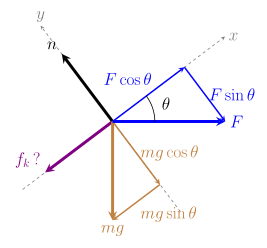
**b)** Find the frictional force
$$
\begin{aligned}
\sum F_{x} &= 0 \\
F\cos \theta - f_{k} - mg\sin \theta &= 0 \\
f_{k} &= F\cos \theta - mg\sin \theta \\
f_{k} &= 30\cos 37^{\circ} - (30)(9.8)\sin 37^{\circ} \\
f_{k} &= 23.95907 - 176.93362 \\
f_{k} &= -152.97455 \text{ N}
\end{aligned}
$$
The friction force came out **negative**. We drew $f_k$ as a size (magnitude) with a direction, so a negative answer means the direction we picked was wrong. The size, 152.97455 N, matches the correct answer, but friction actually points **up** the slope.

**c)** Find the coefficient of kinetic friction

The normal force doesn't depend on friction, so it's the same as before: $n = 252.85329$ N.
$$
\begin{aligned}
\mu_{k} &= \frac{f_{k}}{n} \\
\mu_{k} &= \frac{-152.97455}{252.85329} \\
\mu_{k} &= -0.60499
\end{aligned}
$$
A coefficient of friction can **never be negative**. This is the red flag that tells us to go back and fix the free body diagram.

**Takeaway:** If a force that should be positive (like $f_k$, $n$, or $\mu_k$) comes out negative, check the direction you assumed. Friction always points **opposite the motion**, so figure out which way the box is actually moving before drawing $f_k$.

---
## Example 2-4
**Problem:** A 40 kg box is placed on an incline of 30$^{\circ}$ with a force of 300 N applied 20$^{\circ}$ above the horizontal plane. The box is accelerating up the slope at 0.32 m/s$^2$.

$$
\begin{gathered}
\textbf{Formulas:} \\
\sum \vec{F}= m \vec{a} \\
\mu_{k}=\frac{f_{k}}{n}
\end{gathered}
$$
**a)** Draw a free body diagram

The first diagram shows the forces and the angles between them. The second splits *mg* and *F* into parts along the tilted axes, with +*x* up the slope.
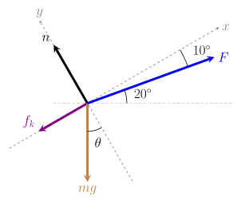
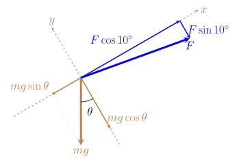
**b)** Find the frictional force between the box and the incline

*F* is 20° above the horizontal and the incline is 30°, so *F* is $30^{\circ} - 20^{\circ} = 10^{\circ}$ away from the slope. The push up the slope ($F\cos 10^{\circ} \approx 295$ N) beats gravity down the slope ($mg\sin\theta = 196$ N), so the box accelerates **up** the slope and friction points **down** the slope.
$$
\begin{aligned}
\sum F_{x} &= ma \\
F\cos 10^{\circ} - f_{k} - mg\sin \theta &= ma \\
f_{k} &= F\cos 10^{\circ} - mg\sin \theta - ma \\
f_{k} &= 300\cos 10^{\circ} - (40)(9.8)\sin 30^{\circ} - (40)(0.32) \\
f_{k} &= 295.44233 - 196 - 12.8 \\
f_{k} &= \boxed{86.64233 \text{ N}}
\end{aligned}
$$
**c)** What is the coefficient of kinetic friction between the box and the incline?

*F* is angled 10° into the slope, so $F\sin 10^{\circ}$ adds to how hard the box presses on the incline:
$$
\begin{aligned}
\sum F_{y}&=0 \\
n - mg\cos \theta - F\sin 10^{\circ} &= 0 \\
n &= mg\cos \theta + F\sin 10^{\circ} \\
n &= (40)(9.8)\cos 30^{\circ} + 300\sin 10^{\circ} \\
n &= 339.48196 + 52.09445 \\
n &= 391.57641 \text{ N}
\end{aligned}
$$
$$
\begin{aligned}
\mu_{k} &= \frac{f_{k}}{n} \\
\mu_{k} &= \frac{86.64233}{391.57641} \\
\mu_{k} &= \boxed{0.22127}
\end{aligned}
$$

---
## Example 2-5
**Problem:** A 12 kg box slides down an incline of 28$^{\circ}$ with no applied force. The box is accelerating down the slope at 2.1 m/s$^2$.

$$
\begin{gathered}
\textbf{Formulas:} \\
\sum \vec{F}= m \vec{a} \\
\mu_{k}=\frac{f_{k}}{n}
\end{gathered}
$$
**a)** Draw a free body diagram

There's no push this time, so only three forces act: gravity, the normal force, and kinetic friction. The box slides **down** the slope, so friction points **up** the slope. Take +*x* down the slope, the way the box is moving.
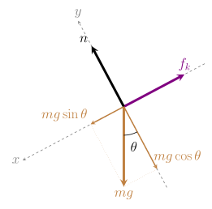
**b)** Find the frictional force between the box and the incline

With +*x* down the slope, $mg\sin\theta$ pulls the box down and friction holds it back. What's left over is *ma*:
$$
\begin{aligned}
\sum F_{x} &= ma \\
mg\sin \theta - f_{k} &= ma \\
f_{k} &= mg\sin \theta - ma \\
f_{k} &= (12)(9.8)\sin 28^{\circ} - (12)(2.1) \\
f_{k} &= 55.20986 - 25.2 \\
f_{k} &= \boxed{30.00986 \text{ N}}
\end{aligned}
$$
**c)** Find the normal force

Nothing presses into the slope except gravity, so *n* balances $mg\cos\theta$:
$$
\begin{aligned}
\sum F_{y}&=0 \\
n - mg\cos \theta &= 0 \\
n &= mg\cos \theta \\
n &= (12)(9.8)\cos 28^{\circ} \\
n &= \boxed{103.83464 \text{ N}}
\end{aligned}
$$
**d)** What is the coefficient of kinetic friction between the box and the incline?

Divide the friction force by the normal force:
$$
\begin{aligned}
\mu_{k} &= \frac{f_{k}}{n} \\
\mu_{k} &= \frac{30.00986}{103.83464} \\
\mu_{k} &= \boxed{0.28902}
\end{aligned}
$$
**e)** At what angle would the box slide down at a constant speed?
$$
\begin{aligned}
\sum F_{x} &= 0 \\
mg\sin \theta - \mu_{k}mg\cos \theta &= 0 \\
\sin \theta &= \mu_{k}\cos \theta \\
\tan \theta &= \mu_{k} \\
\theta &= \tan^{-1}(0.28902) \\
\theta &= \boxed{16.12013^{\circ}}
\end{aligned}
$$
The mass cancels, so any box made of the same material would slide at a constant speed at this angle. On a steeper slope it speeds up (like at 28°), and on a shallower slope it slows down.

---
## Example 2-6
**Problem:** A 30 kg crate sits at rest on a level floor. The coefficient of static friction is $\mu_s$ = 0.50 and the coefficient of kinetic friction is $\mu_k$ = 0.35. A rope pulls on the crate at 25$^{\circ}$ above the horizontal.

$$
\begin{gathered}
\textbf{Formulas:} \\
\sum \vec{F}= m \vec{a} \\
f_{s} \le \mu_{s}n \\
f_{k} = \mu_{k}n
\end{gathered}
$$
**a)** Draw a free body diagram

Four forces act on the crate: gravity, the normal force, the rope's pull *F* at 25°, and friction. The rope tries to drag the crate forward, so friction points **backward**. Until the crate starts moving, this is **static** friction.
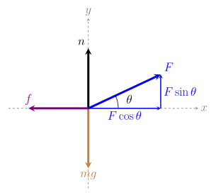
**b)** If the rope pulls with *F* = 120 N, does the crate move? What is the frictional force?

First find the normal force. The rope lifts on the crate a little, so *n* is less than *mg*:
$$
\begin{aligned}
\sum F_{y}&=0 \\
n + F\sin \theta - mg &= 0 \\
n &= mg - F\sin \theta \\
n &= (30)(9.8) - 120\sin 25^{\circ} \\
n &= 294 - 50.71419 \\
n &= 243.28581 \text{ N}
\end{aligned}
$$
The most static friction can give:
$$
\begin{aligned}
f_{s,max} &= \mu_{s}n \\
f_{s,max} &= (0.50)(243.28581) \\
f_{s,max} &= 121.64290 \text{ N}
\end{aligned}
$$
The pull along the floor:
$$
\begin{aligned}
F\cos \theta &= 120\cos 25^{\circ} \\
F\cos \theta &= 108.75693 \text{ N}
\end{aligned}
$$
Since $108.75693 \text{ N} < 121.64290 \text{ N}$, the crate **does not move**. Static friction only pushes back as hard as it needs to:
$$
\begin{aligned}
\sum F_{x} &= 0 \\
F\cos \theta - f_{s} &= 0 \\
f_{s} &= F\cos \theta \\
f_{s} &= \boxed{108.75693 \text{ N}}
\end{aligned}
$$
The friction force is 108.76 N, **not** $\mu_s n$ = 121.64 N. $\mu_s n$ is only the *most* static friction can give.

**c)** What is the smallest force *F* that will start the crate moving?

The crate is just about to move when static friction is at its maximum, $f_s = \mu_s n$. The normal force depends on *F*, so keep it as $n = mg - F\sin\theta$:
$$
\begin{aligned}
F\cos \theta &= \mu_{s}n \\
F\cos \theta &= \mu_{s}(mg - F\sin \theta) \\
F\cos \theta + \mu_{s}F\sin \theta &= \mu_{s}mg \\
F(\cos \theta + \mu_{s}\sin \theta) &= \mu_{s}mg \\
F &= \frac{\mu_{s}mg}{\cos \theta + \mu_{s}\sin \theta} \\
F &= \frac{(0.50)(30)(9.8)}{\cos 25^{\circ} + 0.50\sin 25^{\circ}} \\
F &= \frac{147}{1.11762} \\
F &= \boxed{131.52986 \text{ N}}
\end{aligned}
$$
**d)** Once the crate starts moving, the rope keeps pulling with that same force. What is the crate's acceleration?

Now the crate is sliding, so friction switches to **kinetic** friction, $f_k = \mu_k n$:
$$
\begin{aligned}
n &= mg - F\sin \theta \\
n &= 294 - 131.52986\sin 25^{\circ} \\
n &= 294 - 55.58692 \\
n &= 238.41308 \text{ N}
\end{aligned}
$$
$$
\begin{aligned}
f_{k} &= \mu_{k}n \\
f_{k} &= (0.35)(238.41308) \\
f_{k} &= 83.44458 \text{ N}
\end{aligned}
$$
$$
\begin{aligned}
\sum F_{x} &= ma \\
F\cos \theta - f_{k} &= ma \\
a &= \frac{F\cos \theta - f_{k}}{m} \\
a &= \frac{131.52986\cos 25^{\circ} - 83.44458}{30} \\
a &= \frac{119.20654 - 83.44458}{30} \\
a &= \boxed{1.19207 \text{ m/s}^2}
\end{aligned}
$$
The moment the crate breaks free, friction drops from 119.21 N (static) to 83.44 N (kinetic). The same pull that was *just* balanced a moment ago now wins, so the crate lurches forward. This is why it's harder to get something moving than to keep it moving.

---
# Constant Speed Rotations
## Example 3-1
**Problem:** An object of mass m = 30 $kg$ sits on a platform that moves in a circular motion. The object moves in a vertical circle of radius 10 $m$ at a constant speed of 4 $m/s$.

$$
\begin{gathered}
\textbf{Formulas:} \\
\sum \vec{F}= m \vec{a} \\
a_{c}=\frac{v^2}{r}
\end{gathered}
$$
**a)** Determine the force exerted by the platform on the object at the bottom of the ride, start with a free body diagram.

At the bottom, the center of the circle is **above** the object, so the centripetal acceleration points **up**. Take +*y* up. The platform has to push up harder than gravity pulls down, and the difference is what keeps the object moving in a circle, so *n* comes out bigger than *mg*.
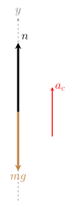
$$
\begin{aligned}
n-mg&=ma_{c} \\
n-mg&=\frac{mv^2}{r} \\
n&=\frac{mv^2}{r}+mg \\
n&=mg\,\left( 1+\frac{v^2}{rg} \right) \\
n&= (30)(9.8)\cdot\left( 1+\frac{(4)^2}{(10)(9.8)} \right) \\
n&= \boxed{342 \text{ N}}
\end{aligned}
$$
**b)** Find the force exerted by the platform on the object at the top of the ride, start with a free body diagram.

At the top, the center of the circle is **below** the object, so the acceleration points **down** (negative with +*y* up). Now gravity helps pull the object toward the center, so the platform doesn't have to push as hard and *n* comes out smaller than *mg*.
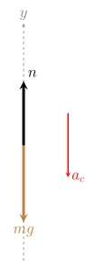
$$
\begin{aligned}
n-mg&=-\frac{mv^2}{r} \\
n&= mg-\frac{mv^2}{r} \\
n&= m\left( g-\frac{v^2}{r} \right) \\
n&= (30)\cdot\left(9.8-\frac{(4)^2}{10} \right) \\
n&= \boxed{246 \text{ N}}
\end{aligned}
$$

---
## Example 3-2
**Problem:** An object of mass m = 1.2 $kg$ is attached to a rope that moves in a circular motion. The object moves in a vertical circle of radius 0.5 $m$. 

$$
\begin{gathered}
\textbf{Formulas:} \\
\sum \vec{F}= m \vec{a} \\
a_{c}=\frac{v^2}{r}
\end{gathered}
$$
**a)** Determine the speed of the object when the object is at its lowest point and the tension on the rope is $23.7 \text{ N}$.  

At the lowest point, the center of the circle is **above** the object, so the acceleration points **up**. The rope's tension has to hold up the object's weight **and** supply the extra pull toward the center. Use Newton's 2nd law and solve for *v*.
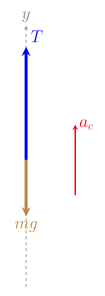
$$
\begin{aligned}
T-mg&=ma_{c} \\
T-mg&=\frac{mv^2}{r} \\
v^2&= \frac{r}{m}(T-mg) \\
v&= \sqrt{\frac{r}{m}(T-mg)} \\
v&= \sqrt{\frac{0.5}{1.2}(23.7-(1.2)(9.8))} \\
v&= \sqrt{\frac{0.5}{1.2}(11.94)} \\
v &= \boxed{2.23047 \text{ m/s}}
\end{aligned}
$$

---
## Example 3-3
**Problem:** The object from Example 3-1 (mass *m* = 30 kg) rides on a platform moving in a vertical circle of radius 10 m. How fast would the platform have to go for the object to feel **weightless** at the top of the ride?

$$
\begin{gathered}
\textbf{Formulas:} \\
\sum \vec{F}= m \vec{a} \\
a_{c}=\frac{v^2}{r}
\end{gathered}
$$
**a)** What does "weightless" mean for the force from the platform? Draw a free body diagram at the top.

"Weightless" means the platform isn't pushing on the object at all, so $n = 0$. The only force left is gravity, and it alone has to supply the pull toward the center.
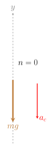
**b)** Find the speed that makes the object feel weightless at the top.

At the top, the center of the circle is **below** the object, so the acceleration points **down** (negative with +*y* up). Set $n = 0$ and solve for *v*:
$$
\begin{aligned}
n-mg&=-\frac{mv^2}{r} \\
0-mg&=-\frac{mv^2}{r} \\
g&=\frac{v^2}{r} \\
v&=\sqrt{gr} \\
v&=\sqrt{(9.8)(10)} \\
v&= \boxed{9.89949 \text{ m/s}}
\end{aligned}
$$
**c)** Would a heavier object need a different speed? What happens if the ride goes faster than this?

**No.** The mass cancelled in part (b), so every object feels weightless at the same speed, 9.89949 m/s. If the ride goes **faster**, gravity alone isn't strong enough to pull the object around the circle, and the platform can only push, not pull. The object would lift off the platform, which is why rides have seat belts.

---
## Example 3-4
**Problem:** The object from Example 3-2 (mass *m* = 1.2 kg) swings on a rope in a vertical circle of radius 0.5 m. At the top of the circle it is moving at 3.0 m/s.

$$
\begin{gathered}
\textbf{Formulas:} \\
\sum \vec{F}= m \vec{a} \\
a_{c}=\frac{v^2}{r}
\end{gathered}
$$
**a)** Draw a free body diagram at the top of the circle.

At the top, the center of the circle (the pivot) is **below** the object. The rope pulls toward the pivot, so tension points **down**, and so does gravity. Both point toward the center, so together they provide the pull that keeps the object moving in a circle.
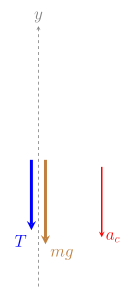
**b)** Find the tension in the rope at the top.

Take +*y* up. Tension, gravity and the acceleration all point down, so they are all negative:
$$
\begin{aligned}
-T-mg&=-\frac{mv^2}{r} \\
T&=\frac{mv^2}{r}-mg \\
T&=\frac{(1.2)(3.0)^2}{0.5}-(1.2)(9.8) \\
T&= 21.6-11.76 \\
T&= \boxed{9.84 \text{ N}}
\end{aligned}
$$
Compare this with the bottom (Example 3-2): at the top gravity does part of the job, so the rope doesn't have to pull as hard.

**c)** What is the slowest the object can move at the top without the rope going slack?

Going slower means less pull is needed toward the center. At the slowest possible speed, the tension drops all the way to zero and gravity alone keeps the object on the circle. Any slower and the rope goes slack. Set $T = 0$:
$$
\begin{aligned}
T&=\frac{mv^2}{r}-mg \\
0&=\frac{mv^2}{r}-mg \\
v^2&= gr \\
v&=\sqrt{gr} \\
v&=\sqrt{(9.8)(0.5)} \\
v&= \boxed{2.21359 \text{ m/s}}
\end{aligned}
$$
This is the same $\sqrt{gr}$ as Example 3-3. In both cases gravity alone is doing all the pulling toward the center.

---
## Example 3-5
**Problem:** The same 1.2 kg object swings on a rope in a vertical circle of radius 0.5 m, but the rope breaks if the tension goes over 50 N.

$$
\begin{gathered}
\textbf{Formulas:} \\
\sum \vec{F}= m \vec{a} \\
a_{c}=\frac{v^2}{r}
\end{gathered}
$$
**a)** Where in the circle is the tension the biggest? Why?

At the **bottom**. There the rope has to hold up the object's weight **and** pull it toward the center, so $T = mg + \frac{mv^2}{r}$. At the top gravity helps pull toward the center, so the rope pulls less ($T = \frac{mv^2}{r} - mg$). A real swinging object also moves fastest at the bottom, which makes the tension there even bigger.

**b)** Draw a free body diagram at that point.

At the bottom, the center of the circle is **above** the object, so the acceleration points **up**. The rope pulls up at its 50 N limit, and gravity pulls down.
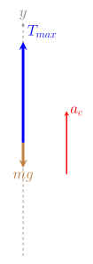
**c)** What is the fastest the object can go there without breaking the rope?

Set the tension equal to its limit and solve for *v*, just like Example 3-2:
$$
\begin{aligned}
T_{max}-mg&=\frac{mv^2}{r} \\
v^2&= \frac{r}{m}(T_{max}-mg) \\
v&= \sqrt{\frac{r}{m}(T_{max}-mg)} \\
v&= \sqrt{\frac{0.5}{1.2}(50-(1.2)(9.8))} \\
v&= \sqrt{\frac{0.5}{1.2}(38.24)} \\
v&= \boxed{3.99166 \text{ m/s}}
\end{aligned}
$$
Any faster and the rope would need to pull harder than 50 N, so it breaks.

---
# Work and the Work–Energy Theorem
## Example 4-1
**Problem:** An object of mass 3000 $kg$ starts at rest and is lifted up by a platform that exerts an upward force of 40 $kN$ on the object. This force is applied over 3 $m$. 

$$
\begin{gathered}
\textbf{Formulas:} \\
W = Fd\cos \theta \quad (\theta \text{ is the angle between the force and the motion}) \\
W_{net} = \Delta KE = KE_{f} - KE_{i} \\
KE = \frac{1}{2}mv^2
\end{gathered}
$$
**a)** Find the net work done on the object

Two forces act on the object: the platform's force *F* pushing up and gravity (*mg*) pulling down. The object moves **up**, so *F* points the same way it moves ($\theta = 0^{\circ}$) and gravity points the opposite way ($\theta = 180^{\circ}$).
$$
\begin{aligned}
W_{1} &= F\Delta r\cos \theta \\
W_{1} &= (40000)(3)\cos 0^{\circ} \\
W_{1} &= 120000 \text{ J} \\
\\
W_{mg} &= mg\Delta r\cos \theta \\
W_{mg} &= (3000)(9.8)(3)\cos 180^{\circ} \\
W_{mg} &= -88200 \text{ J} \\
\\
W_{net} &= W_{1}+W_{mg} \\
W_{net} &= 120000 - 88200 \\
W_{net} &= \boxed{31800 \text{ J}}
\end{aligned}
$$
**b)** Find the upward speed of the object after the 3 $m$.

The net work changes the object's kinetic energy. It starts at rest, so $KE_i = 0$ and all of the net work becomes $KE_f$:
$$
\begin{aligned}
W_{net} &= \Delta KE \\
W_{net} &= KE_{f}-KE_{i} \\
W_{net} &= \frac{1}{2}mv^2_{f} \\
v_{f} &= \sqrt{\frac{2W_{net}}{m}} \\
v_{f} &= \sqrt{\frac{2(31800)}{3000}} \\
v_{f} &= \boxed{4.60435 \text{ m/s}}
\end{aligned}
$$
---
## Example 4-2
**Problem:** Three ropes drag a 15 $kg$ box from rest a distance of 7 $m$ across the floor to the right. All three ropes pull parallel to the floor. One rope pulls with 250 $N$ at 18$^{\circ}$ to one side of the forward direction, the second pulls with 1000 $N$ at 45$^{\circ}$ to the other side of the forward direction, and the third pulls straight backward with 450 $N$.

$$
\begin{gathered}
\textbf{Formulas:} \\
W = Fd\cos \theta \quad (\theta \text{ is the angle between the force and the motion}) \\
W_{net} = \Delta KE = KE_{f} - KE_{i} \\
KE = \frac{1}{2}mv^2
\end{gathered}
$$
**a)** How much work is done by each of the three forces?

For each rope, $\theta$ is the angle between the rope and the direction the box moves (forward). $T_1$ and $T_2$ pull partly forward, so their work is positive. $T_3$ pulls straight **backward** while the box moves forward, so $\theta = 180^{\circ}$ and its work is **negative**.
$$
\begin{aligned}
W_{1} &= T_{1}\Delta x\cos \theta \\
W_{1} &= 250(7)\cos 18^{\circ} \\
W_{1} &= \boxed{1664.34893\text{ J}} \\
\\
W_{2} &= T_{2}\Delta x\cos \theta \\
W_{2} &= 1000(7)\cos 45^{\circ} \\
W_{2} &= \boxed{4949.74747\text{ J}} \\
\\
W_{3} &= T_{3}\Delta x\cos \theta \\
W_{3} &= 450(7)\cos 180^{\circ} \\
W_{3} &= \boxed{-3150\text{ J}}
\end{aligned}
$$
**b)** What is the net work done on the box?
$$
\begin{aligned}
W_{net} &= W_{1}+W_{2}+W_{3} \\
W_{net} &= 1664.34893+4949.74747-3150 \\
W_{net} &= \boxed{3464.09637\text{ J}}
\end{aligned}
$$
**c)** After 7 m, what is the kinetic energy of the box?

The net work changes the box's kinetic energy. It starts at rest, so $KE_i = 0$ and all of the net work becomes $KE_f$:
$$
\begin{aligned}
W_{net} &= \Delta KE \\
W_{net} &= KE_{f}-KE_{i} \\
KE_{f} &= W_{net} \\
KE_{f} &= \boxed{3464.09637\text{ J}}
\end{aligned}
$$

---
## Example 4-3
**Problem:** A 20 $kg$ box starts at rest at the bottom of a 30$^{\circ}$ slope. A 200 $N$ force pushes it 5 $m$ up the slope, parallel to the slope's surface. The coefficient of kinetic friction between the box and the slope is 0.2.

$$
\begin{gathered}
\textbf{Formulas:} \\
W = Fd\cos \theta \quad (\theta \text{ is the angle between the force and the motion}) \\
W_{net} = \Delta KE = KE_{f} - KE_{i} \\
KE = \frac{1}{2}mv^2 \\
f_{k} = \mu_{k}n
\end{gathered}
$$
**a)** Find the work done on the box by each force: the push, gravity, friction, and the normal force.

For each force, $\theta$ is the angle between the force and the direction the box moves (up the slope). The push points up the slope ($\theta = 0^{\circ}$). Gravity points straight down, which is $90^{\circ} + 30^{\circ} = 120^{\circ}$ from the motion. Friction points down the slope ($\theta = 180^{\circ}$), and the normal force is perpendicular to the slope ($\theta = 90^{\circ}$), so it does no work.
$$
\begin{aligned}
W_{F} &= Fd\cos \theta \\
W_{F} &= (200)(5)\cos 0^{\circ} \\
W_{F} &= \boxed{1000 \text{ J}} \\
\\
W_{mg} &= mgd\cos \theta \\
W_{mg} &= (20)(9.8)(5)\cos 120^{\circ} \\
W_{mg} &= \boxed{-490 \text{ J}}
\end{aligned}
$$
To find the work done by friction, first find the friction force. The push is parallel to the slope, so the normal force just balances $mg\cos\theta$:
$$
\begin{aligned}
n &= mg\cos 30^{\circ} \\
n&= (20)(9.8)\cos 30^{\circ} \\
n &= 169.74098 \text{ N} \\
\\
f_{k} &= \mu_{k}n \\
f_{k} &= (0.2)(169.74098) \\
f_{k} &= 33.94820 \text{ N} \\
\\
W_{f} &= f_{k}d\cos \theta \\
W_{f} &= (33.94820)(5)\cos 180^{\circ} \\
W_{f} &= \boxed{-169.74098 \text{ J}} \\
\\
W_{n} &= nd\cos 90^{\circ} = \boxed{0 \text{ J}}
\end{aligned}
$$
**b)** What is the net work done on the box?
$$
\begin{aligned}
W_{net} &= W_{F}+W_{mg}+W_{f}+W_{n} \\
W_{net} &= 1000-490-169.74098+0 \\
W_{net} &= \boxed{340.25902 \text{ J}}
\end{aligned}
$$
**c)** How fast is the box moving after 5 $m$?

The box starts at rest, so $KE_i = 0$ and all of the net work becomes $KE_f$:
$$
\begin{aligned}
W_{net} &= KE_{f}-KE_{i} \\
W_{net} &= \frac{1}{2}mv_{f}^2 \\
v_{f} &= \sqrt{\frac{2W_{net}}{m}} \\
v_{f} &= \sqrt{\frac{2(340.25902)}{20}} \\
v_{f} &= \boxed{5.83317 \text{ m/s}}
\end{aligned}
$$

---
## Example 4-4
**Problem:** The 3000 $kg$ object from Example 4-1 starts at rest and is lifted 3 $m$ by a platform. How strong would the platform's upward force need to be for the object to be moving upward at 6 $m/s$ after the 3 $m$?

$$
\begin{gathered}
\textbf{Formulas:} \\
W = Fd\cos \theta \quad (\theta \text{ is the angle between the force and the motion}) \\
W_{net} = \Delta KE = KE_{f} - KE_{i} \\
KE = \frac{1}{2}mv^2
\end{gathered}
$$
**a)** How much net work is needed?

This is Example 4-1 run backwards: we know how fast the object should end up, so we can find the net work first. It starts at rest, so $KE_i = 0$:
$$
\begin{aligned}
W_{net} &= KE_{f}-KE_{i} \\
W_{net} &= \frac{1}{2}mv_{f}^2 \\
W_{net} &= \frac{1}{2}(3000)(6)^2 \\
W_{net} &= \boxed{54000 \text{ J}}
\end{aligned}
$$
**b)** How much work does gravity do?

The object moves up and gravity points down, so $\theta = 180^{\circ}$. This is the same as in Example 4-1:
$$
\begin{aligned}
W_{mg} &= mgd\cos \theta \\
W_{mg} &= (3000)(9.8)(3)\cos 180^{\circ} \\
W_{mg} &= \boxed{-88200 \text{ J}}
\end{aligned}
$$
**c)** How much work must the platform do, and how big is its force?

The net work is the platform's work plus gravity's work. The platform has to supply the 54000 J of net work **and** make up for the 88200 J that gravity takes away:
$$
\begin{aligned}
W_{net} &= W_{F}+W_{mg} \\
W_{F} &= W_{net}-W_{mg} \\
W_{F} &= 54000-(-88200) \\
W_{F} &= \boxed{142200 \text{ J}} \\
\\
W_{F} &= Fd\cos 0^{\circ} \\
F &= \frac{W_{F}}{d} \\
F &= \frac{142200}{3} \\
F &= \boxed{47400 \text{ N}}
\end{aligned}
$$
That's 47.4 kN, compared with the 40 kN in Example 4-1, which only got the object to 4.60 m/s.

---
## Example 4-5
**Problem:** A 20 $kg$ box is dragged 5 $m$ across the floor from rest by two ropes. The first rope pulls with 150 $N$ at 30$^{\circ}$ above the horizontal, and the second rope pulls straight forward with 80 $N$. The coefficient of kinetic friction between the box and the floor is 0.3.

$$
\begin{gathered}
\textbf{Formulas:} \\
W = Fd\cos \theta \quad (\theta \text{ is the angle between the force and the motion}) \\
W_{net} = \Delta KE = KE_{f} - KE_{i} \\
KE = \frac{1}{2}mv^2 \\
f_{k} = \mu_{k}n
\end{gathered}
$$
**a)** Find the normal force and the friction force on the box.

The first rope pulls partly **up**, which lifts on the box a little, so the floor doesn't have to push as hard. Nothing moves up or down, so the vertical forces balance:
$$
\begin{aligned}
\sum F_{y} &= 0 \\
n+T_{1}\sin 30^{\circ}-mg &= 0 \\
n &= mg-T_{1}\sin 30^{\circ} \\
n &= (20)(9.8)-150\sin 30^{\circ} \\
n &= 196-75 \\
n &= \boxed{121 \text{ N}} \\
\\
f_{k} &= \mu_{k}n \\
f_{k} &= (0.3)(121) \\
f_{k} &= \boxed{36.3 \text{ N}}
\end{aligned}
$$
**b)** Find the work done by each force: both ropes, friction, gravity, and the normal force.

The box moves forward. Rope 1 is $30^{\circ}$ from the motion, rope 2 points straight along it, and friction points straight against it. Gravity and the normal force are both perpendicular to the motion ($\theta = 90^{\circ}$), so they do **no work**.
$$
\begin{aligned}
W_{1} &= T_{1}d\cos \theta \\
W_{1} &= (150)(5)\cos 30^{\circ} \\
W_{1} &= \boxed{649.51905 \text{ J}} \\
\\
W_{2} &= T_{2}d\cos \theta \\
W_{2} &= (80)(5)\cos 0^{\circ} \\
W_{2} &= \boxed{400 \text{ J}} \\
\\
W_{f} &= f_{k}d\cos \theta \\
W_{f} &= (36.3)(5)\cos 180^{\circ} \\
W_{f} &= \boxed{-181.5 \text{ J}} \\
\\
W_{mg} &= W_{n} = \boxed{0 \text{ J}}
\end{aligned}
$$
**c)** What is the net work, and how fast is the box moving after 5 $m$?
$$
\begin{aligned}
W_{net} &= W_{1}+W_{2}+W_{f}+W_{mg}+W_{n} \\
W_{net} &= 649.51905+400-181.5+0+0 \\
W_{net} &= \boxed{868.01905 \text{ J}}
\end{aligned}
$$
The box starts at rest, so all of the net work becomes $KE_f$:
$$
\begin{aligned}
W_{net} &= \frac{1}{2}mv_{f}^2 \\
v_{f} &= \sqrt{\frac{2W_{net}}{m}} \\
v_{f} &= \sqrt{\frac{2(868.01905)}{20}} \\
v_{f} &= \boxed{9.31675 \text{ m/s}}
\end{aligned}
$$

---
## Example 4-6
**Problem:** A 40 $kg$ box is pulled 6 $m$ across the floor from rest by two ropes that both pull parallel to the floor. One rope pulls with 200 $N$ at 15$^{\circ}$ to one side of the forward direction, and the other pulls with 150 $N$ at 40$^{\circ}$ to the other side. Friction acts on the box, and after the 6 $m$ the box is moving at 6 $m/s$.

$$
\begin{gathered}
\textbf{Formulas:} \\
W = Fd\cos \theta \quad (\theta \text{ is the angle between the force and the motion}) \\
W_{net} = \Delta KE = KE_{f} - KE_{i} \\
KE = \frac{1}{2}mv^2 \\
f_{k} = \mu_{k}n
\end{gathered}
$$
**a)** How much work is done by each rope?

Both ropes pull partly forward, so both do positive work. $\theta$ is each rope's angle from the forward direction:
$$
\begin{aligned}
W_{1} &= T_{1}d\cos \theta \\
W_{1} &= (200)(6)\cos 15^{\circ} \\
W_{1} &= \boxed{1159.11099 \text{ J}} \\
\\
W_{2} &= T_{2}d\cos \theta \\
W_{2} &= (150)(6)\cos 40^{\circ} \\
W_{2} &= \boxed{689.44 \text{ J}}
\end{aligned}
$$
**b)** What is the box's final kinetic energy, and what is the net work done on it?

We can't find friction's work directly, but we know the final speed. The net work equals the change in kinetic energy, and the box starts at rest:
$$
\begin{aligned}
KE_{f} &= \frac{1}{2}mv_{f}^2 \\
KE_{f} &= \frac{1}{2}(40)(6)^2 \\
KE_{f} &= \boxed{720 \text{ J}} \\
\\
W_{net} &= KE_{f}-KE_{i} \\
W_{net} &= 720-0 \\
W_{net} &= \boxed{720 \text{ J}}
\end{aligned}
$$
**c)** How much work does friction do? Find the friction force and the coefficient of kinetic friction.

The ropes did 1848.55 J of work, but the box only gained 720 J of kinetic energy. Friction took away the difference. (Gravity and the normal force are perpendicular to the motion, so they do no work.)
$$
\begin{aligned}
W_{net} &= W_{1}+W_{2}+W_{f} \\
W_{f} &= W_{net}-W_{1}-W_{2} \\
W_{f} &= 720-1159.11099-689.44 \\
W_{f} &= \boxed{-1128.55099 \text{ J}}
\end{aligned}
$$
Friction points against the motion ($\theta = 180^{\circ}$), so $W_f = -f_k d$. Both ropes are horizontal, so the normal force is just $mg$:
$$
\begin{aligned}
f_{k} &= \frac{-W_{f}}{d} \\
f_{k} &= \frac{1128.55099}{6} \\
f_{k} &= \boxed{188.09183 \text{ N}} \\
\\
\mu_{k} &= \frac{f_{k}}{n} = \frac{f_{k}}{mg} \\
\mu_{k} &= \frac{188.09183}{(40)(9.8)} \\
\mu_{k} &= \boxed{0.47983}
\end{aligned}
$$
---
# Energy Conservation with Springs, Hills and Friction
## Example 5-1
**Problem:** An object of mass 80 kg is at the top of a frictionless slide of height 20 $m$. It is sitting against a spring that is compressed by 1 m and has a spring constant of *k* = 50,000 N/m.

$$
\begin{gathered}
\textbf{Formulas:} \\
KE = \frac{1}{2}mv^2 \qquad U_{g} = mgh \qquad U_{s} = \frac{1}{2}kx^2 \\ \\
KE_{i} + U_{i} = KE_{f} + U_{f} \text{ (no friction)}
\end{gathered}
$$
**a)** What is the elastic potential energy stored in the compressed spring?

The spring is compressed by $x = 1$ m, so it stores elastic potential energy:
$$
\begin{aligned}
U_{s} &= \frac{1}{2}kx^2 \\
U_{s} &= \frac{1}{2}(50000)(1)^2 \\
U_{s} &= \boxed{25000 \text{ J}}
\end{aligned}
$$
**b)** What is the object's speed just after it leaves the spring?

When the object leaves the spring (point B), all of the spring's energy has turned into kinetic energy. The object is still at the top, so its height (and $U_{g}$) hasn't changed and we can leave gravity out of this step.
$$
\begin{aligned}
U_{s_{A}} &= KE_{B} \\
\frac{1}{2}kx^2 &= \frac{1}{2}mv_{B}^2 \\
v_{B} &= \sqrt{\frac{kx^2}{m}} \\
v_{B} &= \sqrt{\frac{(50000)(1)^2}{80}} \\
v_{B} &= \sqrt{625} \\
v_{B} &= \boxed{25 \text{ m/s}}
\end{aligned}
$$
**c)** What is the object's speed at ground level?

The slide is frictionless, so no energy is lost. At ground level (point C) the height is 0, so all of the energy (spring and gravity) has become kinetic energy. Going straight from A to C:
$$
\begin{aligned}
KE_{A} + U_{g_{A}} + U_{s_{A}} &= KE_{C} + U_{g_{C}} \\
0 + mgh + \frac{1}{2}kx^2 &= \frac{1}{2}mv_{C}^2 + 0 \\
(80)(9.8)(20) + 25000 &= \frac{1}{2}(80)v_{C}^2 \\
15680 + 25000 &= 40v_{C}^2 \\
40680 &= 40v_{C}^2 \\
v_{C} &= \sqrt{1017} \\
v_{C} &= \boxed{31.89044 \text{ m/s}}
\end{aligned}
$$

---
## Example 5-2
**Problem:** A block with a mass of 5 $kg$ is pushed with a velocity of 10 $m/s$ along a frictionless track from one level to a higher level after passing through an intermediate valley. Once the block reaches the higher level it levels off into a frictional horizontal plane. The higher plane is 1.1 $m$ higher than the initial plane. The frictional force of the plane is 11.8 $N$.

$$
\begin{gathered}
\textbf{Formulas:} \\
KE = \frac{1}{2}mv^2 \qquad U_{g} = mgh \\ \\
KE_{i} + U_{i} = KE_{f} + U_{f} + f d \\ \\
\text{(}fd\text{ is the energy friction takes away over a distance } d\text{)}
\end{gathered}
$$
**a)** What is the initial kinetic energy of the block?
$$
\begin{aligned}
KE_{i} &= \frac{1}{2}mv_{0}^2 \\
KE_{i} &= \frac{1}{2}(5)(10)^2 \\
KE_{i} &= \boxed{250 \text{ J}}
\end{aligned}
$$
**b)** How far does the block slide along the frictional plane before it stops?

The track is frictionless all the way to the higher level, so the valley doesn't matter: only the starting and ending heights do. Going up 1.1 m turns some kinetic energy into gravitational potential energy. Whatever kinetic energy is left is then taken away by friction until the block stops ($KE_{f} = 0$).

Measure heights from the starting level, so $U_{i} = 0$ and the block ends at $h = 1.1$ m:
$$
\begin{aligned}
KE_{i} + U_{i} &= KE_{f} + U_{f} + fd \\
KE_{i} + 0 &= 0 + mgh + fd \\
d &= \frac{KE_{i} - mgh}{f} \\
d &= \frac{250 - (5)(9.8)(1.1)}{11.8} \\
d &= \frac{250 - 53.9}{11.8} \\
d &= \frac{196.1}{11.8} \\
d &= \boxed{16.61864 \text{ m}}
\end{aligned}
$$
Check: the block has 250 J and only needs 53.9 J to climb 1.1 m, so it does make it to the higher level with 196.1 J left for friction to use up.

---
## Example 5-3
**Problem:** A block with a mass of 10 kg is pushed from a frictionless horizontal plane with a speed of 45 $m/s$. The plane is a series of hills and valleys that dip down to the initial elevation.

$$
\begin{gathered}
\textbf{Formulas:} \\
KE = \frac{1}{2}mv^2 \qquad U_{g} = mgh \\ \\
KE_{i} + U_{i} = KE_{f} + U_{f} \text{ (no friction)}
\end{gathered}
$$
**a)** What is the maximum height the hills can have for the block to keep sliding over them forever?

The track is frictionless, so the block never loses energy. Every time it climbs a hill, kinetic energy turns into potential energy, and it gets it all back going down into the next valley. The block makes it over a hill as long as it still has some speed at the top. The tallest hill it could *just* reach is where **all** of its kinetic energy has turned into potential energy:
$$
\begin{aligned}
KE_{i} + U_{i} &= KE_{top} + U_{top} \\
\frac{1}{2}mv_{0}^2 + 0 &= 0 + mgh_{max} \\
h_{max} &= \frac{v_{0}^2}{2g} \\
h_{max} &= \frac{(45)^2}{2(9.8)} \\
h_{max} &= \frac{2025}{19.6} \\
h_{max} &= 103.31633 \text{ m} \\ \\
h &< \boxed{103.31633 \text{ m}}
\end{aligned}
$$
The mass cancels, so the 10 kg doesn't matter. At exactly 103.31633 m the block would have $v = 0$ right on top of the hill and stop there. Any hill shorter than that leaves the block with some kinetic energy at the top, so its speed there is greater than 0 and it rolls over. Because there's no friction, it gets all that energy back going down into the next valley, so it can do this forever. That's why the answer is every height **below** 103.31633 m, not the value itself.

---
## Example 5-4
**Problem:** An object of mass 30 kg sits at the top of a frictionless slope that is 20 m high. The object is pushed up against a spring that is compressed 1.2 m and has a k value of 50,000 N/m. At the end of the slope there is a 20 m track of a frictional horizontal surface with a coefficient of friction of 0.32. After the frictional surface there is an infinite frictionless incline.

$$
\begin{gathered}
\textbf{Formulas:} \\
KE = \frac{1}{2}mv^2 \qquad U_{g} = mgh \qquad U_{s} = \frac{1}{2}kx^2 \\ \\
KE_{i} + U_{i} + W_{f} = KE_{f} + U_{f} \\ \\
f_{k} = \mu_{k} n \qquad n = mg \text{ (flat surface)} \\
W_{f} = -f_{k}\, d
\end{gathered}
$$
**a)** What are the kinetic and potential energy of the object before the spring releases its energy?

The object starts at rest, so it has no kinetic energy. All of its energy is stored as potential energy: gravitational (from being 20 m up) and spring (from the compressed spring).
$$
\begin{aligned}
KE_{A} &= \boxed{0 \text{ J}} \\ \\
U_{A} &= U_{g_{A}} + U_{s_{A}} \\
U_{A} &= mgh_{A} + \frac{1}{2}kx^2 \\
U_{A} &= (30)(9.8)(20) + \frac{1}{2}(50000)(1.2)^2 \\
U_{A} &= 5880 \text{ J} + 36000 \text{ J} \\
U_{A} &= \boxed{41880 \text{ J}}
\end{aligned}
$$
This total, $E_{A} = 41880 \text{ J}$, is the energy the object has to work with for the rest of the problem.
**b)** After the spring has released its energy, but before the object goes down the slope, what are its kinetic energy, potential energy and velocity?

The spring's energy turns into kinetic energy. The object is still at the top, so the gravitational potential energy hasn't changed.
$$
\begin{aligned}
U_{g_{B}} &= \boxed{5880 \text{ J}} \\ \\
KE_{B} &= E_{A} - U_{g_{B}} \\
KE_{B} &= 41880 \text{ J} - 5880 \text{ J} \\
KE_{B} &= \boxed{36000 \text{ J}}
\end{aligned}
$$
$$
\begin{aligned}
KE_{B} &= \frac{1}{2}mv_{B}^2 \\
2KE_{B} &= mv_{B}^2 \\
\frac{2KE_{B}}{m} &= v_{B}^2 \\
\sqrt{\frac{2KE_{B}}{m}} &= v_{B} \\
\sqrt{\frac{2(36000)}{30}} &= v_{B} \\
v_{B} &= \boxed{20\sqrt{ 6 } \approx 48.98979 \text{ m/s}}
\end{aligned}
$$
**c)** At point C, just before the rough track, what are the object's kinetic energy, potential energy and velocity?

From B to C the object slides down the frictionless slope, so no energy is lost. It ends up at ground level ($U_{g} = 0$), so all of the gravitational potential energy it had at the top has turned into extra kinetic energy.
$$
\begin{aligned}
U_{g_{C}} &= \boxed{0 \text{ J}} \\
\\
KE_{C} &= KE_{B}+U_{g_{B}} \\
KE_{C} &= 36000 \text{ J} + 5880 \text{ J} \\
KE_{C} &= \boxed{41880 \text{ J}}
\end{aligned}
$$
$$
\begin{aligned}
KE_{C} &= \frac{1}{2}mv_{C}^2 \\
\frac{2KE_{C}}{m} &= v_{C}^2 \\
\sqrt{\frac{2KE_{C}}{m}} &= v_{C} \\
\sqrt{\frac{2(41880)}{30}} &= v_{C} \\
v_{C} &= \boxed{\sqrt{2792} \approx 52.83938 \text{ m/s}}
\end{aligned}
$$
**d)** At point D, the end of the rough track, what are the object's kinetic energy, potential energy and velocity?

The track from C to D is flat, so the object stays at ground level ($U_{g} = 0$) and the normal force just balances gravity: $n = mg$. Friction takes energy away as the object slides the 20 m.
$$
\begin{aligned}
U_{g_{D}} &= \boxed{0 \text{ J}} \\
\\
KE_{D} &= KE_{C}- f_{k}d \\
KE_{D} &= KE_{C}- \mu_{k}nd \\
KE_{D} &= KE_{C}-\mu_{k}(mg)d \\
KE_{D} &= 41880-0.32(30)(9.8)(20) \\
KE_{D} &= \boxed{39998.4\text{ J}}
\end{aligned}
$$
$$
\begin{aligned}
KE_{D} &= \frac{1}{2}mv_{D}^2 \\
\frac{2KE_{D}}{m} &= v_{D}^2 \\
\sqrt{\frac{2KE_{D}}{m}} &= v_{D} \\
\sqrt{\frac{2(39998.4)}{30}} &= v_{D} \\
v_{D} &= \boxed{\sqrt{2666.56} \approx 51.63874 \text{ m/s}}
\end{aligned}
$$

**e)** How high up the incline does the object get before it stops?

The incline is frictionless, so no energy is lost on the way up. The object stops at E, so $KE_{E} = 0$ and all of its kinetic energy from D has turned into gravitational potential energy.
$$
\begin{aligned}
KE_{D} &= U_{E} \\
KE_{D} &= mgh_{E} \\
\frac{KE_{D}}{mg} &= h_{E} \\
\frac{39998.4}{(30)(9.8)} &= h_{E} \\
h_{E} &= \boxed{136.04898 \text{ m}}
\end{aligned}
$$

**Start to finish in one step:** We can also skip the middle points and go straight from A to E. The only energy lost along the whole path is the work done by friction on the rough track ($f_{k}d$), so everything the object starts with ends up either as height at E or lost to friction.
$$
\begin{aligned}
KE_{A} + U_{A} &= KE_{E} + U_{E} + f_{k}d \\
KE_{A} + U_{g_{A}} + U_{s_{A}} &= KE_{E} + U_{g_{E}} + \mu_{k}(mg)d \\
0 + mgh_{A} + \frac{1}{2}kx^2 &= 0 + mgh_{E} + \mu_{k}(mg)d \\
mgh_{A}+\frac{1}{2}kx^2-\mu_{k}(m)(g)(d) &= mgh_{E} \\
\frac{mgh_{A}+\frac{1}{2}kx^2-\mu_{k}(m)(g)(d)}{mg} &= h_{E} \\
\frac{(30)(9.8)(20)+\frac{1}{2}(50000)(1.2)^2-(0.32)(30)(9.8)(20)}{(30)(9.8)} &= h_{E} \\
\frac{5880+36000-1881.6}{294} &= h_{E} \\
\frac{39998.4}{294} &= h_{E} \\
h_{E} &= \boxed{136.04898 \text{ m}}
\end{aligned}
$$
Same answer. Notice $KE_{A} = 0$ (starts at rest) and $KE_{E} = 0$ (stops at E), so this is really just: starting potential energy = final potential energy + energy lost to friction. Here $f_{k}d$ is the energy friction takes away, which is the same as $-W_{f}$ in the formula $KE_{i} + U_{i} + W_{f} = KE_{f} + U_{f}$.

---
## Example 5-5
**Problem:** A block with a mass of 10 kg is pushed along a horizontal plane with a speed of 40 $m/s$. The plane is a series of frictionless hills that go up 45 $m$ and valleys that dip down to the initial elevation. Before the first hill, and in each valley, there is a 5 m frictional horizontal plane with a coefficient of friction of 0.65.

$$
\begin{gathered}
\textbf{Formulas:} \\
KE = \frac{1}{2}mv^2 \qquad U_{g} = mgh \\ \\
f_{k} = \mu_{k} n \qquad n = mg \text{ (flat surface)} \\
\text{Energy lost per rough section} = f_{k}d = \mu_{k}mgd \\ \\
\text{To get over a hill: } KE_{\text{before hill}} > mgh \\ \\
KE_{\text{after } N \text{ rough sections}} = KE_{i} - N\mu_{k}mgd
\end{gathered}
$$
**a)** How many hills can the block get over before it can't make it over the next one?

The hills are frictionless, so the block gets back all the energy it spends climbing each one. Only the rough sections take energy away, and each one takes the same amount. So we need three numbers: the starting kinetic energy, the energy needed to get over a hill, and the energy lost in each rough section.
$$
\begin{aligned}
KE_{i} &= \frac{1}{2}mv_{i}^2 \\
KE_{i} &= \frac{1}{2}(10)(40)^2 \\
KE_{i} &= 8000\text{ J} \\
\\
f_{k} &= \mu_{k}n \\
f_{k} &= \mu_{k}mg \\
f_{k} &= (0.65)(10)(9.8) \\
f_{k} &= 63.7\text{ N} \\
\\
E_{lost} &= f_{k}d \\
E_{lost} &= (63.7)(5) \\
E_{lost} &= 318.5\text{ J (in each rough section)} \\
\\
U_{g} &= mgh \\
U_{g} &= (10)(9.8)(45) \\
U_{g} &= 4410\text{ J}
\end{aligned}
$$
$$
\begin{aligned}
KE_{i} - NE_{lost} &< U_{g} \\
KE_{i}-U_{g} &< NE_{lost} \\
\frac{KE_{i}-U_{g}}{E_{lost}} &< N \\
\frac{8000\text{ J}- 4410\text{ J}}{318.5\text{ J}} &< N \\
N &> 11.27159
\end{aligned}
$$
Here $N$ is the number of rough sections the block has crossed. There's a rough section right before every hill, so the block crosses rough section 1, then tries hill 1, crosses rough section 2, then tries hill 2, and so on. The block gets stuck once $N$ is bigger than 11.27159, so it fails right after the **12th** rough section. Count it out:
- After 11 rough sections: $KE = 8000 - 11(318.5) = 4496.5 \text{ J} > 4410 \text{ J}$, so it still gets over hill 11.
- After 12 rough sections: $KE = 8000 - 12(318.5) = 4178 \text{ J} < 4410 \text{ J}$, so it can't get over hill 12.

So the block makes it over hill 11 but not hill 12:
$$
\boxed{11 \text{ hills}}
$$

---
# Momentum and Collisions
## Example 6-1
**Problem:** A 1200 $kg$ car traveling east at 15 $m/s$ collides at an intersection with a 1500 $kg$ truck traveling north at 10 $m/s$. The two vehicles lock together and slide off as one.

$$
\begin{gathered}
\textbf{Formulas:} \\
\vec{p} = m\vec{v} \\ \\
\text{Perfectly inelastic: } m_{1}v_{1x} + m_{2}v_{2x} = (m_{1}+m_{2})v_{fx} \\
m_{1}v_{1y} + m_{2}v_{2y} = (m_{1}+m_{2})v_{fy} \\ \\
v_{f} = \sqrt{v_{fx}^2 + v_{fy}^2} \qquad \theta = \tan^{-1}\left(\frac{v_{fy}}{v_{fx}}\right) \\ \\
KE = \frac{1}{2}mv^2
\end{gathered}
$$
**a)** Explain why this is a perfectly inelastic collision.

The car and truck lock together and move as one object after the crash. Any collision where the objects **stick together** is perfectly inelastic. Momentum is still conserved, but kinetic energy is not: some of it turns into heat, sound, and bent metal.
**b)** Find the velocity (magnitude and direction) of the wreck right after the collision.

Momentum is conserved separately in the *x* and *y* directions. Take east as $+x$ and north as $+y$. The car only moves in *x* and the truck only moves in *y*, so each direction only has one object's momentum to start.
$$
\begin{aligned}
m_{1}v_{1x} + m_{2}v_{2x} &= (m_{1}+m_{2})v_{fx} \\
(1200)(15) + (1500)(0) &= (1200+1500)v_{fx} \\
18000 &= 2700v_{fx} \\
v_{fx} &= 6.66667 \text{ m/s}
\end{aligned}
$$
$$
\begin{aligned}
m_{1}v_{1y} + m_{2}v_{2y} &= (m_{1}+m_{2})v_{fy} \\
(1200)(0) + (1500)(10) &= (1200+1500)v_{fy} \\
15000 &= 2700v_{fy} \\
v_{fy} &= 5.55556 \text{ m/s}
\end{aligned}
$$
Now combine the two parts to get the speed and direction:
$$
\begin{aligned}
v_{f} &= \sqrt{v_{fx}^2 + v_{fy}^2} \\
v_{f} &= \sqrt{(6.66667)^2 + (5.55556)^2} \\
v_{f} &= \boxed{8.67806 \text{ m/s}} \\ \\
\theta &= \tan^{-1}\left(\frac{v_{fy}}{v_{fx}}\right) \\
\theta &= \tan^{-1}\left(\frac{5.55556}{6.66667}\right) \\
\theta &= \boxed{39.80557^{\circ} \text{ north of east}}
\end{aligned}
$$
**c)** How much kinetic energy is lost in the collision?

Compare the total kinetic energy before and after:
$$
\begin{aligned}
KE_{i} &= \frac{1}{2}m_{1}v_{1}^2 + \frac{1}{2}m_{2}v_{2}^2 \\
KE_{i} &= \frac{1}{2}(1200)(15)^2 + \frac{1}{2}(1500)(10)^2 \\
KE_{i} &= 135000 \text{ J} + 75000 \text{ J} \\
KE_{i} &= 210000 \text{ J} \\ \\
KE_{f} &= \frac{1}{2}(m_{1}+m_{2})v_{f}^2 \\
KE_{f} &= \frac{1}{2}(2700)(8.67806)^2 \\
KE_{f} &= 101666.66667 \text{ J} \\ \\
KE_{lost} &= KE_{i} - KE_{f} \\
KE_{lost} &= 210000 - 101666.66667 \\
KE_{lost} &= \boxed{108333.33333 \text{ J}}
\end{aligned}
$$
More than half (about 52%) of the kinetic energy is lost, even though momentum is perfectly conserved. That's normal for a collision where things stick together.

---
## Example 6-2
**Problem:** An 80 $kg$ hockey player skating east at 6 $m/s$ collides head-on with a 100 $kg$ player skating west at 4 $m/s$. The two players grab onto each other and move together after the collision.

$$
\begin{gathered}
\textbf{Formulas:} \\
p = mv \\ \\
\text{Perfectly inelastic: } m_{1}v_{1} + m_{2}v_{2} = (m_{1}+m_{2})v_{f}
\end{gathered}
$$
**a)** Find the velocity (magnitude and direction) of the two players right after the collision.

Everything happens along one line, so we only need one equation. The key is the **signs**: take east as positive, so the player skating west has a **negative** velocity.
$$
\begin{aligned}
m_{1}v_{1} + m_{2}v_{2} &= (m_{1}+m_{2})v_{f} \\
(80)(6) + (100)(-4) &= (80+100)v_{f} \\
480 - 400 &= 180v_{f} \\
80 &= 180v_{f} \\
v_{f} &= \boxed{0.44444 \text{ m/s east}}
\end{aligned}
$$
The answer is positive, so the players move **east**. The 100 kg player is heavier, but the 80 kg player is moving faster and has more momentum (480 kg·m/s vs 400 kg·m/s), so they win.
**b)** How fast would the 100 $kg$ player need to be skating west for the two players to stop completely after the collision?

For the players to stop, the total momentum after the collision has to be zero. Since momentum is conserved, the total before has to be zero too, so the two momenta have to cancel:
$$
\begin{aligned}
m_{1}v_{1} + m_{2}v_{2} &= 0 \\
(80)(6) + (100)(-v_{2}) &= 0 \\
480 &= 100v_{2} \\
v_{2} &= \boxed{4.8 \text{ m/s west}}
\end{aligned}
$$

---
## Example 6-3
**Problem:** A 70 $kg$ running back running east is tackled by a 90 $kg$ linebacker running north. Right after the tackle, the two players move together at 4 $m/s$ at 30$^{\circ}$ north of east.

$$
\begin{gathered}
\textbf{Formulas:} \\
\vec{p} = m\vec{v} \\ \\
\text{Perfectly inelastic: } m_{1}v_{1x} + m_{2}v_{2x} = (m_{1}+m_{2})v_{fx} \\
m_{1}v_{1y} + m_{2}v_{2y} = (m_{1}+m_{2})v_{fy} \\ \\
v_{fx} = v_{f}\cos\theta \qquad v_{fy} = v_{f}\sin\theta
\end{gathered}
$$
**a)** Find the speed of each player just before the tackle.

This is a perfectly inelastic collision run backwards: we know the final velocity and need the starting speeds. First split the final velocity into its east ($x$) and north ($y$) parts:
$$
\begin{aligned}
v_{fx} &= v_{f}\cos 30^{\circ} = (4)\cos 30^{\circ} = 3.46410 \text{ m/s} \\
v_{fy} &= v_{f}\sin 30^{\circ} = (4)\sin 30^{\circ} = 2 \text{ m/s}
\end{aligned}
$$
The running back only moves east, so all of the $x$ momentum after the tackle came from him. The linebacker only moves north, so all of the $y$ momentum came from him.
$$
\begin{aligned}
m_{1}v_{1} + 0 &= (m_{1}+m_{2})v_{fx} \\
(70)v_{1} &= (160)(3.46410) \\
v_{1} &= \frac{554.25626}{70} \\
v_{1} &= \boxed{7.91795 \text{ m/s}}
\end{aligned}
$$
$$
\begin{aligned}
0 + m_{2}v_{2} &= (m_{1}+m_{2})v_{fy} \\
(90)v_{2} &= (160)(2) \\
v_{2} &= \frac{320}{90} \\
v_{2} &= \boxed{3.55556 \text{ m/s}}
\end{aligned}
$$

---
## Example 6-4
**Problem:** Two pucks slide on frictionless ice. A 2 $kg$ puck slides east at 3 $m/s$. A 3 $kg$ puck slides at 2 $m/s$ in a direction 60$^{\circ}$ north of west. The pucks collide and stick together.

$$
\begin{gathered}
\textbf{Formulas:} \\
\vec{p} = m\vec{v} \qquad p_{x} = mv\cos\theta \qquad p_{y} = mv\sin\theta \\ \\
\text{Perfectly inelastic: } p_{1x} + p_{2x} = (m_{1}+m_{2})v_{fx} \\
p_{1y} + p_{2y} = (m_{1}+m_{2})v_{fy} \\ \\
v_{f} = \sqrt{v_{fx}^2 + v_{fy}^2} \qquad \theta = \tan^{-1}\left(\frac{v_{fy}}{v_{fx}}\right)
\end{gathered}
$$
**a)** Find the $x$ (east) and $y$ (north) components of each puck's momentum before the collision.

Take east as $+x$ and north as $+y$. Puck 1 moves straight east, so it only has $x$ momentum. Puck 2 moves 60° north of **west**, so its $x$ part points west (**negative**) and its $y$ part points north (positive).
$$
\begin{aligned}
p_{1x} &= (2)(3) = \boxed{6 \text{ kg·m/s}} \\
p_{1y} &= \boxed{0} \\ \\
p_{2x} &= -(3)(2)\cos 60^{\circ} = \boxed{-3 \text{ kg·m/s}} \\
p_{2y} &= (3)(2)\sin 60^{\circ} = \boxed{5.19615 \text{ kg·m/s}}
\end{aligned}
$$
**b)** Find the velocity (magnitude and direction) of the pucks after the collision.

Add up the momentum in each direction, then divide by the combined mass (5 kg):
$$
\begin{aligned}
p_{1x} + p_{2x} &= (m_{1}+m_{2})v_{fx} \\
6 + (-3) &= 5v_{fx} \\
v_{fx} &= 0.6 \text{ m/s} \\ \\
p_{1y} + p_{2y} &= (m_{1}+m_{2})v_{fy} \\
0 + 5.19615 &= 5v_{fy} \\
v_{fy} &= 1.03923 \text{ m/s}
\end{aligned}
$$
$$
\begin{aligned}
v_{f} &= \sqrt{(0.6)^2 + (1.03923)^2} \\
v_{f} &= \boxed{1.2 \text{ m/s}} \\ \\
\theta &= \tan^{-1}\left(\frac{1.03923}{0.6}\right) \\
\theta &= \boxed{60^{\circ} \text{ north of east}}
\end{aligned}
$$
Both final parts are positive, so the pucks move north and east.
